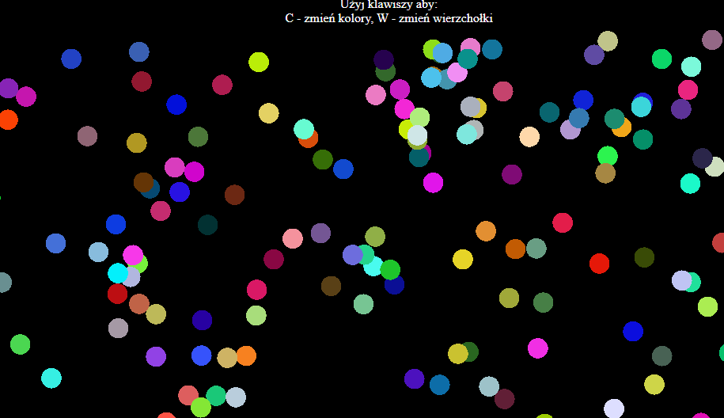

<h1>SPRAWOZDANIE</h1>
<h4 align="center">Zajęcia: Grafika komputerowa</h4>
<h4 align="center">Prowadzący: prof. dr hab. Vasyl Martsenyuk</h4>

&nbsp;

&nbsp;

&nbsp;

&nbsp;

&nbsp;

<h4 align="center"><b>Laboratorium: </b>10</h4>
<h4 align="center"><b>Data: </b>30.05.2023</h4>
<h4 align="center"><b>Temat: </b>Podstawy WebGL/GLSL</h4>
<h4 align="center"><b>Wariant: </b>8</h4>

&nbsp;

&nbsp;

&nbsp;

&nbsp;

&nbsp;

&nbsp;

<h4 align="end">Igor Gawłowicz,</h4>
<h4 align="end">Informatyka I stopień,</h4>
<h4 align="end">4 semestr,</h4>
<h4 align="end">Gr. 2b</h4>

[Kod projektu - Github](https://github.com/Zciwolvo/GrafikaKomputerowa/tree/main/Lab10)

Deklaracja i inicjalizacja zmiennych, w tym kontekstu WebGL i lokalizacji zmiennych uniform oraz atrybutów w shaderze:
W kontekście WebGL deklarujemy i inicjalizujemy zmienne, aby przechowywać i manipulować danymi w programach shaderów. Dotyczy to zmiennych reprezentujących atrybuty (takie jak pozycje, kolory) wierzchołków oraz zmiennych uniform (takie jak macierze transformacji, samplery tekstur), które są stałe dla wszystkich wierzchołków lub fragmentów. Aby uzyskać dostęp do tych zmiennych w programach shaderów, musimy określić ich lokalizacje za pomocą funkcji specyficznych dla WebGL, które pozwalają na komunikację między JavaScriptem a shaderami.

Funkcje pomocnicze, takie jak `randomizeColor()` i `changeShape()`:
Te funkcje służą do dodatkowej funkcjonalności aplikacji WebGL. Na przykład, funkcja `randomizeColor()` generuje losowe kolory i przypisuje je do punktów, wprowadzając wizualne zróżnicowanie do sceny. Funkcja `changeShape()` zmienia kształt punktów, umożliwiając różne reprezentacje wizualne. Te funkcje ulepszają interakcję użytkownika, umożliwiając dynamiczną zmianę wyglądu sceny WebGL.

Funkcje `render()`, `createData()` i `updateData()`:

- Funkcja `render()` odpowiada za renderowanie sceny poprzez wywołanie kolejnych etapów potoku WebGL. Ustawia widok (viewport), czyści płótno i wywołuje odpowiednie funkcje WebGL do rysowania punktów wraz z ich atrybutami.
- Funkcja `createData()` generuje dane potrzebne do punktów, takie jak ich pozycje i kolory. Inicjalizuje bufory, w których przechowywane są te dane, umożliwiając efektywne zarządzanie danymi na karcie graficznej (GPU).
- Funkcja `updateData()` dynamicznie aktualizuje dane punktów. Może modyfikować pozycje lub kolory punktów na podstawie określonych reguł lub interakcji użytkownika. Ta funkcja umożliwia responsywność sceny WebGL na zmiany w czasie rzeczywistym.

Funkcja `doKey(evt)`:
Ta funkcja obsługuje naciśnięcia klawiszy w aplikacji WebGL. Po naciśnięciu konkretnego klawisza wywoływane są odpowiednie akcje. Na przykład, naciśnięcie klawisza "c" zmienia tryb kolorowania punktów, a naciśnięcie klawisza "w" zmienia kształt punktów.

Oczywiście! Oto rozbudowane wyjaśnienie pozostałych punktów:

Funkcja `initGL()`:
Funkcja `initGL()` pełni kluczową rolę w inicjalizacji kontekstu WebGL i przygotowaniu środowiska renderowania. Jej zadania obejmują:

- Inicjalizację kontekstu WebGL, co oznacza uzyskanie dostępu do obiektu `canvas` w kodzie HTML i utworzenie kontekstu WebGL za pomocą funkcji `getContext()`.
- Kompilację shaderów wierzchołków i fragmentów. Funkcja `initGL()` wywołuje funkcję `createProgram()` (opisaną poniżej) w celu utworzenia programu WebGL, który składa się z tych dwóch shaderów.
- Tworzenie i konfiguracja buforów dla atrybutów. Funkcja `initGL()` inicjalizuje bufory, które przechowują dane atrybutów (takie jak pozycje, kolory) i ustawia odpowiednie wskaźniki na te bufory w programie WebGL.
- Ustawienie opcji WebGL. Funkcja `initGL()` konfiguruje różne opcje WebGL, takie jak ustawienie koloru czyszczenia płótna, włączenie testu głębokości (depth test) czy ustawienie trybu renderowania.

Funkcja `createProgram(gl, vertexShaderID, fragmentShaderID, attribute0)`:
Funkcja `createProgram()` ma za zadanie utworzyć program WebGL, który jest kombinacją shadera wierzchołków i shadera fragmentów. Jej działanie obejmuje:

- Tworzenie programu WebGL za pomocą funkcji `createProgram()` na obiekcie kontekstu WebGL (`gl`).
- Kompilowanie shadera wierzchołków. Funkcja `createProgram()` pobiera kod shadera wierzchołków z elementu HTML o podanym identyfikatorze (`vertexShaderID`) i kompiluje go za pomocą funkcji `createShader()` i `shaderSource()`.
- Kompilowanie shadera fragmentów. Podobnie jak shader wierzchołków, funkcja `createProgram()` pobiera kod shadera fragmentów z elementu HTML o podanym identyfikatorze (`fragmentShaderID`) i kompiluje go w podobny sposób.
- Połączenie shadera wierzchołków i fragmentów z programem WebGL za pomocą funkcji `attachShader()` i `linkProgram()`.
- Pobranie lokalizacji pierwszego atrybutu (attribute0) w programie WebGL i przypisanie go do wartości przekazanej jako argument (`attribute0`). Lokalizacja ta jest później wykorzystywana do przypisywania danych atrybutów do bufora.

Kod HTML definiuje element `<canvas>`, który służy do renderowania sceny WebGL. Elementy `<script>` zawierają kod JavaScript, który obsługuje aplikację WebGL.

