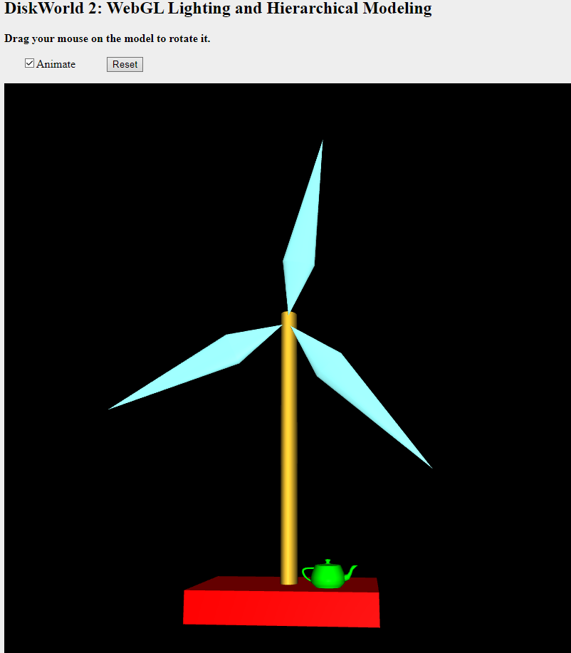

<h1>SPRAWOZDANIE</h1>
<h4 align="center">Zajęcia: Grafika komputerowa</h4>
<h4 align="center">Prowadzący: prof. dr hab. Vasyl Martsenyuk</h4>

&nbsp;

&nbsp;

&nbsp;

&nbsp;

&nbsp;

<h4 align="center"><b>Laboratorium: </b>11</h4>
<h4 align="center"><b>Data: </b>06.06.2023</h4>
<h4 align="center"><b>Temat: </b>Grafika 3D w bibliotece WebGL/GLSL</h4>
<h4 align="center"><b>Wariant: </b>8</h4>

&nbsp;

&nbsp;

&nbsp;

&nbsp;

&nbsp;

&nbsp;

<h4 align="end">Igor Gawłowicz,</h4>
<h4 align="end">Informatyka I stopień,</h4>
<h4 align="end">4 semestr,</h4>
<h4 align="end">Gr. 2b</h4>

[Kod projektu - Github](https://github.com/Zciwolvo/GrafikaKomputerowa/tree/main/Lab11)

## Wiatrak

Podczas projektu stworzono stronę internetową, która wykorzystuje technologię WebGL do renderowania trójwymiarowych obiektów. Strona ta składa się z pliku HTML oraz skryptów JavaScript, które odpowiadają za zarządzanie grafiką i logiką programu.

W pliku HTML zadeklarowano elementy strony, takie jak tytuł, znacznik meta oraz główny kontener, w którym będzie renderowany obraz WebGL. W sekcji `<style>` zdefiniowano style CSS, które wpływają na wygląd elementów strony. W pliku znajduje się również sekcja `<script>`, w której umieszczono kod JavaScript.

W części JavaScript zdefiniowano różne zmienne i stałe, które są używane w programie. Na przykład, zmienna `gl` reprezentuje kontekst WebGL, a zmienna `canvas` odnosi się do elementu `<canvas>`, na którym odbywa się renderowanie.

Następnie zdefiniowano funkcje do rysowania i manipulacji macierzami, które są niezbędne do przekształceń obiektów w trójwymiarowej przestrzeni. Wykorzystano bibliotekę `gl-matrix.js`, która zapewnia funkcje do operacji na macierzach.

W kodzie JavaScript znajduje się również funkcja `draw()`, która odpowiada za renderowanie obrazu. W tej funkcji tworzone są macierze projekcji i widoku, a następnie obiekty geometryczne są renderowane na podstawie danych zdefiniowanych wcześniej. Przykładowe obiekty to "podłoga", "słup", "wiatrak" oraz "czajnik". Każdy z tych obiektów ma swoje własne współrzędne i właściwości materiałowe, takie jak kolor dyfuzyjny i kolor odbicia.

Dodatkowo w projekcie zaimplementowano funkcje `pushMatrix()` i `popMatrix()`, które umożliwiają tworzenie hierarchicznej struktury obiektów. Poprzez dodawanie i usuwanie macierzy na stosie można kontrolować transformacje obiektów w zależności od ich położenia w strukturze hierarchicznej.

Kod JavaScript zawiera również definicje funkcji `createModel()` i `createTeapotModel()`, które służą do tworzenia podstawowych obiektów na podstawie danych geometrii. Funkcje te tworzą i inicjalizują bufory WebGL zawierające współrzędne, wektory normalne i indeksy wierzchołków dla każdego obiektu. Obiekty te można następnie renderować na scenie, wykorzystując wcześniej zdefiniowane bufory.

W celu poprawnego renderowania obiektów WebGL, w kodzie zdefiniowano również szadery w języku GLSL (OpenGL Shading Language). Szadery te są używane do manipulacji wyglądem i właściwościami obiektów renderowanych w WebGL. Szader wierzchołków (`vertex shader`) jest odpowiedzialny za przekształcenie współrzędnych wierzchołków obiektu, a także obliczanie wektorów normalnych i przekazywanie ich do szadera fragmentów (`fragment shader`).

Wszystkie te elementy składają się na pełne funkcjonalności strony internetowej wykorzystującej WebGL do renderowania trójwymiarowych obiektów. Dzięki zastosowaniu bibliotek, takich jak `gl-matrix.js`, oraz wykorzystaniu szaderów GLSL, możliwe jest manipulowanie wyglądem, transformacjami i właściwościami obiektów w przestrzeni trójwymiarowej.

Projekt ten stanowi wspaniałe wprowadzenie do programowania grafiki trójwymiarowej oraz demonstruje praktyczne zastosowanie technologii WebGL. Pozwala on na tworzenie realistycznych scen 3D w przeglądarce internetowej i może stanowić doskonałą podstawę do dalszego eksplorowania tej dziedziny.

Podczas pracy nad projektem nabyto wiele umiejętności, takich jak tworzenie geometrii, renderowanie obiektów, manipulacja macierzami transformacji oraz korzystanie z szaderów GLSL. Projekt umożliwił także zrozumienie podstawowych koncepcji związanych z programowaniem grafiki trójwymiarowej, takich jak oświetlenie, materiały, hierarchie obiektów i tworzenie efektów wizualnych.

Wnioski z tego projektu są niezwykle cenne, ponieważ technologia WebGL staje się coraz bardziej popularna i znajduje zastosowanie w różnych dziedzinach, takich jak gry komputerowe, wizualizacje naukowe, architektura, edukacja i wiele innych. Dzięki zdobytym umiejętnościom uczestnicy projektu mogą kontynuować swoją przygodę z programowaniem grafiki trójwymiarowej lub wykorzystać te umiejętności w innych projektach i dziedzinach związanych z technologią internetową.

Całkowity efekt końcowy projektu jest imponujący, gdyż udało się stworzyć interaktywną stronę internetową, która umożliwia użytkownikom eksplorację trójwymiarowego świata za pomocą ich przeglądarki. Projekt ten jest doskonałym przykładem kreatywnego wykorzystania nowoczesnych technologii internetowych i programowania grafiki trójwymiarowej.

