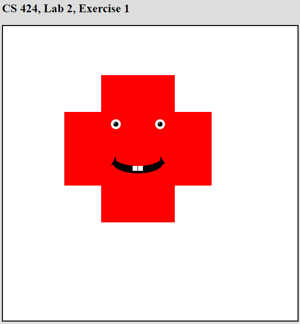
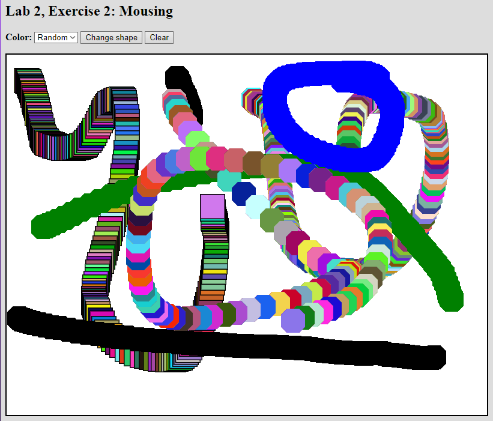

<h1>SPRAWOZDANIE</h1>

Zajęcia: Grafika komputerowa

Prowadzący: prof. dr hab. Vasyl Martsenyuk

&nbsp;

&nbsp;

&nbsp;

&nbsp;

&nbsp;

<b>Laboratorium: </b>2

<b>Data: </b>07.03.2023

<b>Temat: </b>Grafika 2D z użyciem HTML Canvas

<b>Wariant: </b>4

&nbsp;

&nbsp;

&nbsp;

&nbsp;

&nbsp;

&nbsp;

Igor Gawłowicz,

Informatyka I stopień,

4 semestr,

Gr. 2b

1.  **Polecenie nr.1:** \
    Narysować obraz zgodnie z wariantem zadania (patrz Fig. 1) (używając
    zarówno standardowe jak i niestandardowe funkcje rysowania).
2.  **Sposób rozwiązania zadania nr.1:** \
    [<Kod zadanie 1. github>](https://github.com/Zciwolvo/GrafikaKomputerowa/blob/main/Lab2/Lab2Ex1.html) \
     Za pomocą standardowaych funkcji rysowania narysowałem krzyżujące się czerwone prostokąty, następnie oczy składające się z 3 malejących kół, a na końcu usta składające się z dwóch nachodzących na siebie owali, dwóch białych prostokątów stworzonych w odpowiedniej kolejności żeby na siebie dobrze nachodziły, oraz 2 poligonów służących za kąciki ust.

    &nbsp;

      

3.  **Polecenie nr.2:** \
    W pliku Lab2Ex2.html program domyślnie rysuje szereg kwadratów. Stworzyć narzędzia pozwalające na wykonywanie czynności

    - Czyszczenie
    - Dodanie nowego koloru
    - Narzędzie rysowania wielokątów(ośmiokąt).

4.  **Sposób rozwiązania zadania nr.1:** \
    [<Kod zadanie 2. github>](https://github.com/Zciwolvo/GrafikaKomputerowa/blob/main/Lab2/Lab2Ex2.html) \
    Dodanie funkcji czyszczącej plansze było bardzo proste wystarczyło dodać przycisk **Clear**, który przywołuje funkcję inicjalizującą czyli taką która aktywuje się po wczytaniu strony i przywraca wszystko do wartości podstawowych. \
    Nowy kolor dodałem poprzez zmianę dropdown selecta oraz dodanie nowego warunku do bloku if/else \
    Aby dodać nowe narzędzie pędzla w kształcie ośmiokątu, dodałem nową zmienną **shape**, w zależności od której używany jest pędzel kwadratowy lub nowy ośmiokątny, a następnie standardowymi kształtami utworzyłem ośmiokąt z dwóch prostokątów oraz 4 polygonów w kształcie trójkata równobocznego.

    &nbsp;

       

5.  **Wnioski:**

    Funkcje graficzne w języku skryptowym javascript mają bardzo podobnych możliwości do języka Java, jednak przez to że java jest ograniczona do programowania objektowego javascript wydaje się nieco przyjaźniejsza dla początkującego programisty.
