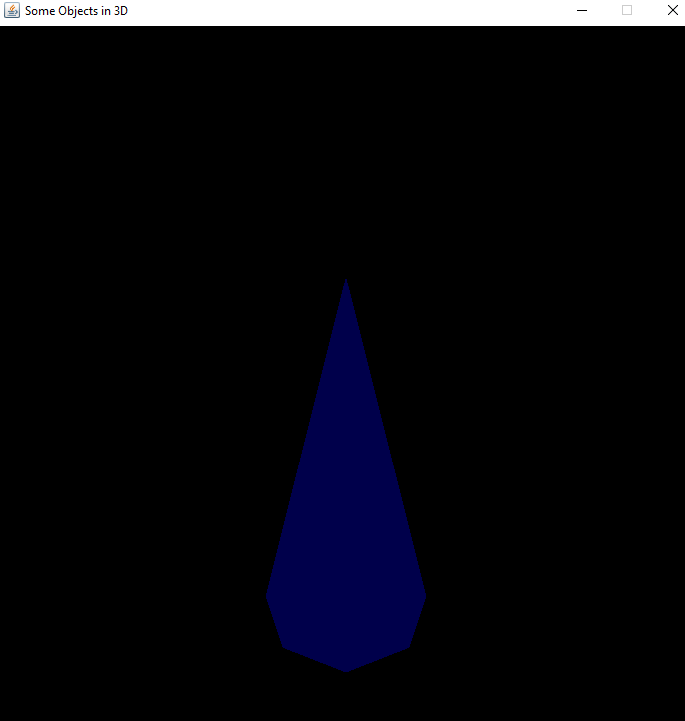

<h1>SPRAWOZDANIE</h1>

Zajęcia: Grafika komputerowa

Prowadzący: prof. dr hab. Vasyl Martsenyuk

&nbsp;

&nbsp;

&nbsp;

&nbsp;

&nbsp;

<b>Laboratorium: </b>6

<b>Data: </b>11.04.2023

<b>Temat: </b>Światło i materiały

<b>Wariant: 8</b>

&nbsp;

&nbsp;

&nbsp;

&nbsp;

&nbsp;

&nbsp;

Igor Gawłowicz,

Informatyka I stopień,

4 semestr,

Gr. 2b

1.  **Polecenie nr. 1.:** \
     Obiekt 1. Korkociąg wokół osi {x | y | z} zawierający N obrotów. Punkty są stopniowo powiększane. Ustalić aktualny kolor rysujący na {zielony | niebieski | brązowy | … }. \
    [<Kod zadanie 1. i 2. github>](https://github.com/Zciwolvo/GrafikaKomputerowa/blob/main/Lab4/lab4.svg)

    &nbsp;

    Korkociąg został stworzony poprzez jedną dość prostą funkcję matematyczną, która w pętli rysuje punkty oddalone od siebie o niewielką przestrzeń tworząc koła w każdej iteracji przy czym wysokość każdego z punktów stale wzrasta sprawiając wrażenie struktury podobnej do sprężyny

       

       
       

2.  **Polecenie nr. 2.:** \
    Obiekt 2: Pyramida, wykorzystując dwa wachlarze trójkątów oraz modelowanie hierarchiczne (najpierw tworzymy podprogramę rysowania jednego trójkonta; dalej wykorzystując przekształcenia geometryczne tworzymy pyramidę). Podstawą pyramidy jest wielokąt o **n** wierzchołkach.

    &nbsp;
    Zaczynamy przez utworzenie funkcji piramida, która za parametry przyjmuje nasz silnik graficzny oraz liczba wierzchołków **n**, następnie iterując przez naszą liczbę wierchołków będziemy potrzebować nowej funkcji, która na podstawie położenia danego wierchołka oraz jego poprzednika utworzy trójkąt za pomocą funkcji matematycznych.

       

       
       

     Podstawa przykładowej piramidy o 8 kątach
       

       
       

3.  **Pozostałe figury:** \
    Dodatkowo stworzyłem sześcian, ze względu na to że nie można go napisać w algorytmiczny sposób ze względu na brak zależności między jego wierchołkami musiałem wypisać współrzędne na osi x,y,z każdego z jego wierchołków. Następnie narysowałem każdą z jego sześciu ścian i otrzymałem kompletny sześcian.

      

       
       

4.  **Wnioski** \
    Biblioteka OpenGL służąca do tworzenia trój wymiarowych obiektów w języku java jest niesamowitym narzędziem z bardzo wieloma możliwościami wliczając w to funkcje wielu obiektów geometrycznych. Jednak moim zdaniem budowanie złożonych tworów za pomocą tych technologii może dla wielu okazać się zbyt zagmatwane przez co prędzej skorzystałbym z silników graficznych jak na przykład unity.
