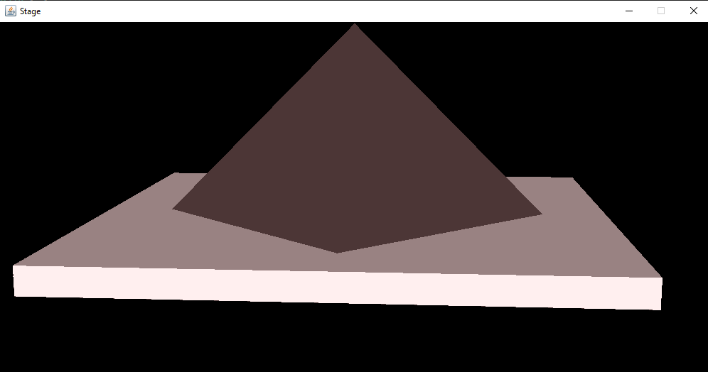
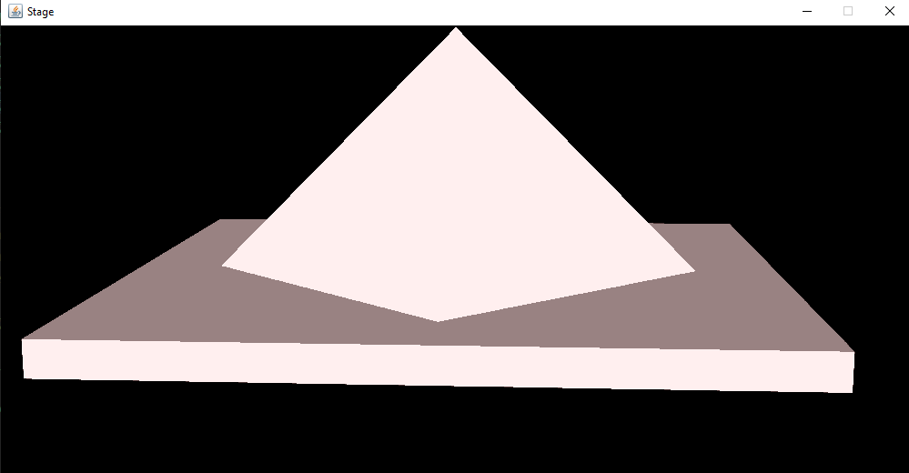

<h1>SPRAWOZDANIE</h1>

Zajęcia: Grafika komputerowa

Prowadzący: prof. dr hab. Vasyl Martsenyuk

&nbsp;

&nbsp;

&nbsp;

&nbsp;

&nbsp;

<b>Laboratorium: </b>1

<b>Data: </b>Data

<b>Temat: </b>Temat

<b>Wariant: </b>Wariant

&nbsp;

&nbsp;

&nbsp;

&nbsp;

&nbsp;

&nbsp;

Igor Gawłowicz,

Informatyka I stopień,

4 semestr,

Gr. 2b

1. Celem projektu było stworzenie piramidy z różnymi materiałami i umieszczenie jej na podstawie, która może obracać się wokół osi Y za pomocą przeciągania myszą w poziomie. Dodatkowo, należało poprawić oświetlenie sceny w celu uzyskania lepszych efektów wizualnych. \
 W projekcie wykorzystałem język Java oraz bibliotekę OpenGL do renderowania grafiki 3D. Stworzyłem klasę Piramida, która generowała wierzchołki i indeksy potrzebne do rysowania piramidy. Następnie utworzyłem klasę Podstawa, która generowała wierzchołki i indeksy potrzebne do rysowania podstawy oraz umieszczała piramidę na podstawie. \
 Do obsługi myszy wykorzystałem bibliotekę GLUT, która umożliwiła mi przechwytywanie zdarzeń z myszy. W przypadku ruchu myszy w poziomie, obrót podstawy był aktualizowany poprzez zmianę wartości kąta obrotu. \
 Podstawowe oświetlenie sceny zostało dodane poprzez ustawienie światła punktowego. Aby uzyskać lepsze efekty, poprawiłem oświetlenie poprzez dodanie światła kierunkowego. Światło kierunkowe zostało umieszczone za sceną i skierowane w kierunku kamery, aby oświetlać piramidę od tyłu. Dodatkowo, dodałem efekt cieniowania na piramidzie, aby uzyskać bardziej realistyczny wygląd.

     

     

2. W rezultacie udało mi się zrealizować projekt, który spełniał wszystkie wymagania postawione przed nim. Oświetlenie sceny zostało poprawione, co dało lepsze efekty wizualne, a możliwość obracania podstawy za pomocą myszy umożliwiła użytkownikowi lepszą interakcję z sceną.
