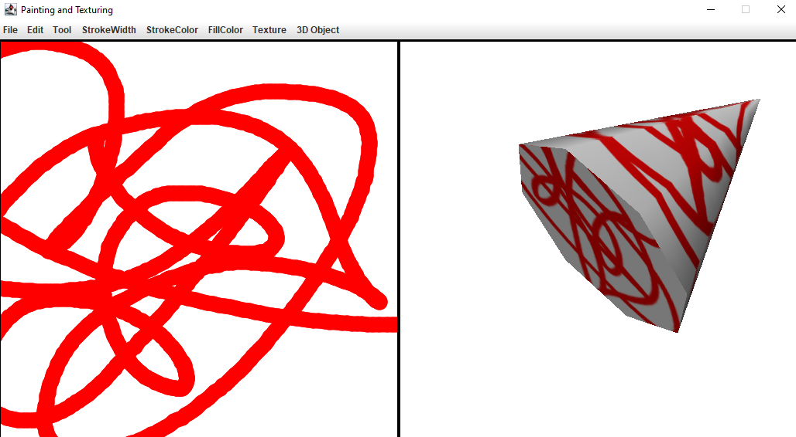
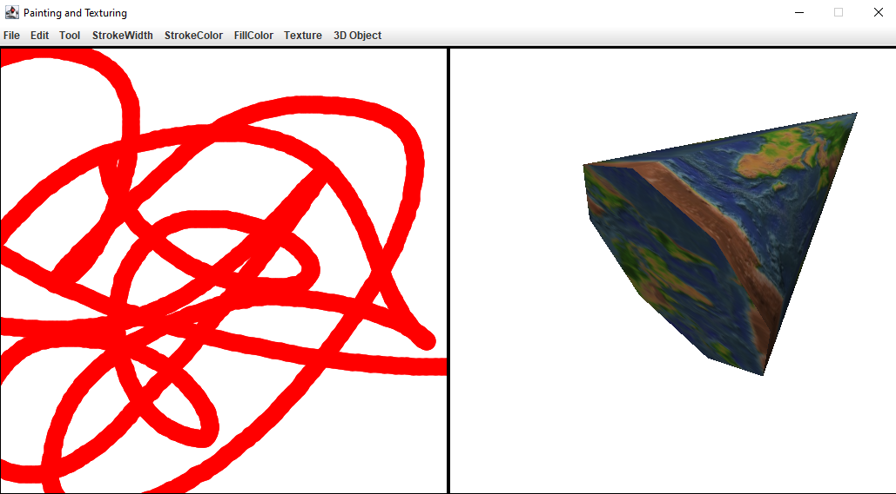

<style>
  h1 {
    border-bottom: 0;
    display: flex;
    flex-direction: column;
    align-items: center;
    margin-bottom: 0;
    font-weight: bold;
  }
  h4{
    font-size: 1.5em;
    margin-bottom: 0;
    font-weight: 300;
  }
</style>

<h1>SPRAWOZDANIE</h1>
<h4 align="center">Zajęcia: Grafika komputerowa</h4>
<h4 align="center">Prowadzący: prof. dr hab. Vasyl Martsenyuk</h4>

&nbsp;

&nbsp;

&nbsp;

&nbsp;

&nbsp;

<h4 align="center"><b>Laboratorium: </b>7</h4>
<h4 align="center"><b>Data: </b>09.05.2023</h4>
<h4 align="center"><b>Temat: </b>Tekstury w OpenGL</h4>
<h4 align="center"><b>Wariant: </b>8</h4>

&nbsp;

&nbsp;

&nbsp;

&nbsp;

&nbsp;

&nbsp;

<h4 align="end">Igor Gawłowicz,</h4>
<h4 align="end">Informatyka I stopień,</h4>
<h4 align="end">4 semestr,</h4>
<h4 align="end">Gr. 2b</h4>

<div style="page-break-after: always;"></div>

## Celem jest teksturowanie piramidy z użyciem dwóch sposobów ładowania tekstur: użycie tekstury z buforu kolorów (rysowanie w Panel)

## Należy opracować metody textureFromPainting() oraz textureFromResource() klasy Lab7.

[Repozytorium do projektu](https://github.com/Zciwolvo/GrafikaKomputerowa/tree/main/Lab7)

### **textureFromResource**

```Java
	private Texture textureFromPainting() {
		BufferedImage img = paintPanel.copyOSC();
		GLContext context = displayGL.getContext();
		boolean needsRelease = !context.isCurrent();
		if (needsRelease) {
			context.makeCurrent();
		}
		GL2 gl2 = context.getGL().getGL2();
		Texture texture = AWTTextureIO.newTexture(displayGL.getGLProfile(), img, true);
		texture.setTexParameteri(gl2, GL2.GL_TEXTURE_WRAP_S, GL2.GL_REPEAT);
		texture.setTexParameteri(gl2, GL2.GL_TEXTURE_WRAP_T, GL2.GL_REPEAT);
		if (needsRelease) {
			context.release();
		}
		return texture;
	}
```

Najpierw metoda pobiera adres URL pliku zasobu z klasy za pomocą metody `getClass().getClassLoader().getResource(resourceName)`. Następnie metoda `ImageIO.read()` odczytuje dane obrazu z pliku zasobu i zwraca obiekt `BufferedImage`.

Aby dostosować obraz do wymagań OpenGL, metoda `ImageUtil.flipImageVertically()` odwraca obraz w pionie.

Następnie metoda pobiera bieżący kontekst OpenGL dla wyświetlacza za pomocą metody `displayGL.getContext()`. Jeśli bieżący wątek nie jest tym, który utworzył kontekst OpenGL, metoda ustawia bieżący wątek jako ten, który utworzył kontekst OpenGL za pomocą metody `context.makeCurrent()`.

Metoda `context.getGL().getGL2()` pobiera obiekt `GL2` dla bieżącego kontekstu OpenGL.

Metoda `AWTTextureIO.newTexture()`orzy nowy obiekt tekstury z danych `BufferedImage`. Metoda `texture.setTexParameteri()` ustawia parametry tekstury dla współrzędnych tekstury `GL_TEXTURE_WRAP_S` i `GL_TEXTURE_WRAP_T` na `GL_REPEAT`.

Jeśli bieżący wątek nie jest tym, który utworzył kontekst OpenGL, metoda `context.release()` zwalnia kontekst OpenGL.

Na końcu metoda zwraca obiekt `texture` jako wynik.

### **textureFromPainting**

```Java
	private void paintingFromOpenGL() {
		GLContext context = displayGL.getContext(); // OpenGL context for the display panel.
		boolean needsRelease = false;  // Will be set to true if context needs to be made current.
		if ( ! context.isCurrent() ) {
			    // Make the context current on the current thread.
			context.makeCurrent();
			needsRelease = true;
		}
		GL2 gl2 = context.getGL().getGL2();
		AWTGLReadBufferUtil readBuf = new AWTGLReadBufferUtil(displayGL.getGLProfile(), false);
		BufferedImage img = readBuf.readPixelsToBufferedImage(gl2, true); // Get display content as image.
		if (needsRelease) {
			context.release();
		}
		paintPanel.installImage(img); // copy the image into the PaintPanel.
	}
```

Metoda `textureFroming` służy do tworzenia tekstury z obrazu rysunku, który jest przechowywany w panelu rysunkowym.

Najpierw metoda tworzy obiekt `BufferedImage` z obrazu rysunku, który jest skopiowany z panelu rysunkowego zaą metody `paintPanel.copyOSC()`.

Następnie metoda pobiera bieżący kontekst OpenGL dla wyświetlacza za pomocą metody `displayGL()`. Jeśli bieżący wątek nie jest tym, który utworzył kontekst OpenGL, metoda ustawia bieżący wątek jako ten, który utworzył kontekst OpenGL za pomocą metody `context.makeCurrent()`.

Metoda `context.getGL().getGL2()` pobiera obiekt `GL2` dla bieżącego kontekstu OpenGL.

Metoda `AWTTextureIO.newTexture()` tworzy nowy obiekt tekstury z danych `BufferedImage`.

Metoda `texture.setTexParameteri()` ustawia parametry tekstury dla współrzędnych tekstury `GL_TEXTURE_WRAP_S` i `GL_TEXTURE_WRAP_T` na `GL_REPEAT`.

Jeśli bieżący wątek nie jest tym, który utworzył kontekst OpenGL, metoda `context.release()` zwalnia kontekst.

Na końcu metoda zwraca obiekt `texture` jako wynik.

<div style="page-break-after: always;"></div>

Następnie, używając gotowych już funkcji służących do budowania figur w programie stworzyłem piramidę odpowiadającom mojemu wariantowi projektu





### **Wnioski**

Używając wbudowanych funkcji biblioteki OpenGL, możemy rozwinąć nasze możliwość teksturowania obiektów zarówno 2-wymiarowych jak i 3-wymiarowych.
