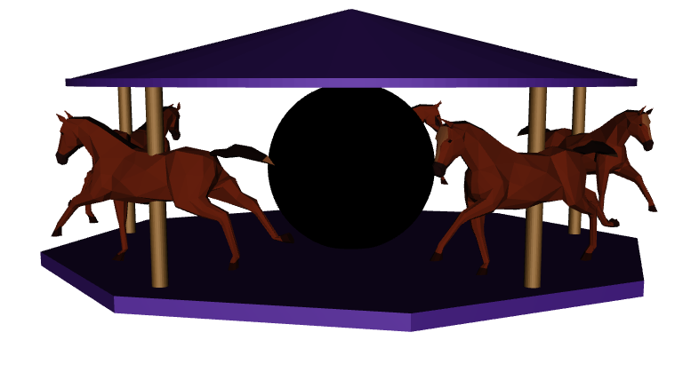

<h1>SPRAWOZDANIE</h1>
<h4 align="center">Zajęcia: Grafika komputerowa</h4>
<h4 align="center">Prowadzący: prof. dr hab. Vasyl Martsenyuk</h4>

&nbsp;

&nbsp;

&nbsp;

&nbsp;

&nbsp;

<h4 align="center"><b>Laboratorium: </b>8</h4>
<h4 align="center"><b>Data: </b>23.05.2023</h4>
<h4 align="center"><b>Temat: </b>Podstawy Three.js</h4>
<h4 align="center"><b>Wariant: </b>8</h4>

&nbsp;

&nbsp;

&nbsp;

&nbsp;

&nbsp;

&nbsp;

<h4 align="end">Igor Gawłowicz,</h4>
<h4 align="end">Informatyka I stopień,</h4>
<h4 align="end">4 semestr,</h4>
<h4 align="end">Gr. 2b</h4>

## Celem jest konstruowanie złożonego modelu za pomocą three.js - animowanej karuzeli

[Kod projektu - Github](https://github.com/Zciwolvo/GrafikaKomputerowa/tree/main/Lab8)

Na początku tworzona jest podłoga za pomocą klasy `THREE.Mesh`, która reprezentuje podłogę w kształcie walca. Ustawiane są parametry geometrii walca, takie jak promień, wysokość i liczba segmentów. Następnie wykorzystywany jest materiał `THREE.MeshPhongMaterial`, który nadaje podłodze określony kolor, połysk i cieniowanie. Obraca się obiekt podłogi o kąt `Math.PI/12` wokół osi y, a następnie dodaje się go do sceny.

Kolejnym krokiem jest utworzenie obiektu `sphere`, który reprezentuje kulę. Wykorzystuje się klasę `THREE.Mesh` oraz określa parametry geometrii kuli, takie jak promień i liczba segmentów. Materiał `THREE.MeshBasicMaterial` z teksturą Earth.jpg nadaje kuli wygląd Ziemi. Kula jest przesuwana wzdłuż osi y, a następnie dodawana do sceny.

Następnie, dla każdego ze słupków od 1 do 5, tworzony jest obiekt `poleX` za pomocą klasy `THREE.Mesh`, który reprezentuje słup. Określa się parametry geometrii słupka, takie jak promień podstawy, wysokość i liczba segmentów. Wykorzystuje się materiał `THREE.MeshPhongMaterial` do nadania słupkowi określonego koloru, połysku i cieniowania. Każdy ze słupków jest przesuwany do określonej pozycji wzdłuż osi x, y i z. Następnie są one obracane o kąt `Math.PI/12` wokół osi y. Słupki są dodawane do sceny.

Po słupkach tworzony jest obiekt `roof`, który reprezentuje dach w kształcie walca. Wykorzystuje się klasę `THREE.Mesh` oraz określa parametry geometrii walca, takie jak promień podstawy, wysokość i liczba segmentów. Materiał `THREE.MeshPhongMaterial` nadaje dachowi określony kolor, połysk i cieniowanie. Dach jest przesuwany wzdłuż osi y i dodawany do sceny.

Ostatnim krokiem jest tworzenie obiektu `roof2`, który reprezentuje drugi dach w kształcie walca. Używa się klasy `THREE.Mesh` oraz określa parametry geometrii walca, takie jak promień podstawy, wysokość i liczba segmentów. Materiał `THREE.MeshPhongMaterial` nadaje drugiemu dachowi określony kolor, połysk i cieniowanie. Dach jest

