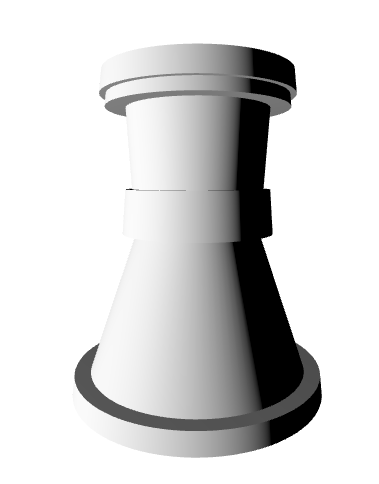

<h1>SPRAWOZDANIE</h1>
<h4 align="center">Zajęcia: Grafika komputerowa</h4>
<h4 align="center">Prowadzący: prof. dr hab. Vasyl Martsenyuk</h4>

&nbsp;

&nbsp;

&nbsp;

&nbsp;

&nbsp;

<h4 align="center"><b>Laboratorium: </b>9</h4>
<h4 align="center"><b>Data: </b>30.05.2023</h4>
<h4 align="center"><b>Temat: </b>Konstruowanie obiektów z użyciem Three.js</h4>
<h4 align="center"><b>Wariant: </b>8</h4>

&nbsp;

&nbsp;

&nbsp;

&nbsp;

&nbsp;

&nbsp;

<h4 align="end">Igor Gawłowicz,</h4>
<h4 align="end">Informatyka I stopień,</h4>
<h4 align="end">4 semestr,</h4>
<h4 align="end">Gr. 2b</h4>

## Celem jest konstruowanie złożonego modelu za pomocą three.js - animowanej karuzeli

[Kod projektu - Github](https://github.com/Zciwolvo/GrafikaKomputerowa/tree/main/Lab9)

Przedstawiony kod jest prostym przykładem interaktywnej sceny trójwymiarowej, która została napisana przy użyciu biblioteki Three.js. Skrypt tworzy scenę, na której widoczna jest biała wieża szachowa.

W sekcji HTML znajduje się struktura strony, w której określono kodowanie znaków oraz stylizację. Dodatkowo, zaimportowano bibliotekę Three.js oraz skrypt "OrbitControls.js" z zewnętrznego źródła CDN.

W skrypcie JavaScript najpierw pobierana jest referencja do elementu `<canvas>`. Następnie tworzone są podstawowe elementy sceny, takie jak scena (`scene`), kamera (`camera`) i renderowanie (`renderer`). Elementy te są dodawane do dokumentu HTML.

Na scenie umieszczona jest biała wieża szachowa, która składa się z różnych części. Wykorzystano geometrię brył walcowych oraz materiał, aby stworzyć poszczególne elementy wieży. Grupa obiektów (`white_rook`) agreguje te elementy i jest umieszczona na scenie.

Aby umożliwić interakcję użytkownika, zastosowano kontrolę kamery przy użyciu `OrbitControls`. Tworzony jest obiekt `controls`, który umożliwia płynne obracanie sceną przy użyciu myszy. Efekt tłumienia (`damping`) jest aktywowany, aby zapewnić płynność interakcji.

W funkcji `animate()` jest obsługiwana animacja, w której odświeżana jest scena oraz aktualizowane są kontrolki kamery. Kamery jest ustawiana na odpowiedniej pozycji wzdłuż osi Z.

Podsumowując, kod tworzy prostą scenę trójwymiarową z białą wieżą szachową, która może być obracana przy użyciu myszy dzięki zastosowaniu kontroli kamery.

